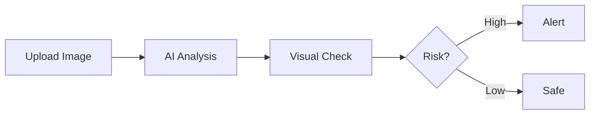

## Overview

ScamShield provides powerful tools to detect fraud in texts, emails, and images. You analyze suspicious content quickly to protect yourself from scams. Key features include advanced NLP for text, visual checks for screenshots, instant risk scores, and clear next steps.

<Columns cols={2}>
  <Card title="Deep Text Forensics" icon="search" href="#deep-text">
    Use NLP to spot scam patterns in messages that humans miss.
  </Card>
  <Card title="Visual Analysis" icon="image" href="#visual-analysis">
    Upload screenshots for AI-powered image checks.
  </Card>
  <Card title="Risk Scoring" icon="bar-chart" href="#risk-scoring">
    Get instant scores from low to high risk.
  </Card>
  <Card title="Next Steps" icon="alert-triangle" href="#next-steps">
    Receive actionable alerts and recommendations.
  </Card>
</Columns>

<Callout kind="info">
  All features work in the dashboard at `https://app.scamshield.my/dashboard` or via API.
</Callout>

## Deep Text Forensics

Deep Text Forensics uses natural language processing (NLP) to detect linguistic patterns common in scams, such as urgency triggers or fake authority claims.

### How It Works

<Tabs>
  <Tab title="Dashboard" icon="monitor">
    Paste text into the scanner. Results appear in seconds.

    <Steps>
      <Step title="Paste Content" icon="clipboard">
        Copy suspicious message or email.
      </Step>
      <Step title="Scan" icon="zap">
        Click Scan. Review NLP highlights.
      </Step>
      <Step title="Act" icon="shield">
        Follow risk-based advice.
      </Step>
    </Steps>
  </Tab>
  <Tab title="API" icon="code">
    Integrate scanning into your apps.

    <CodeGroup tabs="JavaScript,Python">
      ````javascript
      const response = await fetch('https://api.example.com/v1/scan/text', {
        method: 'POST',
        headers: { 'Authorization': 'Bearer YOUR_API_KEY' },
        body: JSON.stringify({ text: 'Your bank account is suspended. Send $500 now.' })
      });
      const result = await response.json();
      console.log(result.riskScore); // e.g., 0.95
      ````
      ````python
      import requests
      response = requests.post(
        'https://api.example.com/v1/scan/text',
        headers={'Authorization': 'Bearer YOUR_API_KEY'},
        json={'text': 'Your bank account is suspended. Send $500 now.'}
      )
      result = response.json()
      print(result['riskScore'])  # e.g., 0.95
      ````
    </CodeGroup>
  </Tab>
</Tabs>

## Visual Analysis

Upload screenshots of profiles, invoices, or chats for AI-driven checks. Detects forged images, suspicious logos, and tampering.

<ParamField path="image" param-type="file" required="true">
  Image file (PNG, JPG, up to 5MB).
</ParamField>

<ParamField query="context" param-type="string" required="false">
  Optional context like `dating-profile` or `invoice`.
</ParamField>



<Expandable title="Advanced Tips" default-open="false">

  For best results, ensure high contrast and full context in images. Avoid blurry photos.

</Expandable>

## Instant Risk Scoring

Every scan returns a score from 0.0 (safe) to 1.0 (high risk). Scores above `0.8` trigger immediate alerts.

<Response tabs="Low Risk,High Risk">
  ````json
  {
    "riskScore": 0.12,
    "category": "safe",
    "explanation": "No scam patterns detected."
  }
  ````
  ````json
  {
    "riskScore": 0.95,
    "category": "high",
    "explanation": "Urgency + fake authority detected.",
    "matches": ["suspended account", "wire money"]
  }
  ````
</Response>

## Actionable Next Steps

After scanning, get tailored advice like "Block sender" or "Report to authorities."

<Callout kind="tip">
  Enable email alerts for scores `>0.7` in dashboard settings.
</Callout>

<Columns cols={3}>
  <Card title="Low Risk" icon="check-circle" horizontal>
    Proceed with caution. Double-check details manually.
  </Card>
  <Card title="Medium Risk" icon="alert-triangle" horizontal>
    Pause and verify sender independently.
  </Card>
  <Card title="High Risk" icon="x-circle" horizontal>
    Block immediately and report.
  </Card>
</Columns>