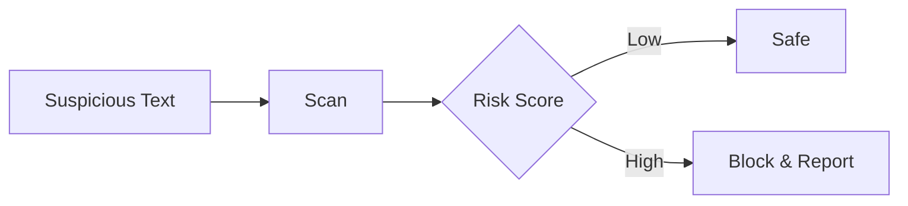

## Prerequisites

<Callout kind="info">
Before you begin, ensure you have:
- A modern web browser like Chrome, Firefox, or Safari
- An active email address for account verification
- Internet connection for real-time scanning
</Callout>

## Create Your Account

Follow these steps to register for ScamShield.

<Steps>
  <Step title="Visit the Dashboard" icon="globe">
    Open your browser and navigate to the [ScamShield dashboard](https://app.scamshield.my/dashboard).
  </Step>
  <Step title="Start Registration" icon="user-plus">
    Click the `Sign Up` button. Enter your email address and create a strong password.
  </Step>
  <Step title="Verify Email" icon="mail">
    Check your inbox for a verification email from ScamShield. Click the link to confirm your account.
  </Step>
  <Step title="Complete Profile" icon="edit-3">
    Return to the dashboard, fill in your name and phone number (optional for alerts), then click `Save`.
  </Step>
</Steps>

## Log In and Explore the Dashboard

Once registered, log in to access your personalized dashboard.

<Steps>
  <Step title="Log In" icon="log-in">
    Enter your email and password on the login page. Use two-factor authentication if enabled.
  </Step>
  <Step title="Dashboard Overview" icon="layout">
    You'll see sections for `Scanner`, `History`, `Community`, and `Pricing`. Start with `Scanner`.
  </Step>
</Steps>

## Perform Your First Scam Scan

Scan suspicious messages instantly.

<Tabs>
  <Tab title="Text Message" icon="message-circle">
    <Steps>
      <Step title="Paste Text" icon="clipboard">
        In the Scanner, paste the suspicious text: `Hi, your package is delayed. Pay $25 fee here: [link]. Reply STOP to cancel.`
      </Step>
      <Step title="Run Scan" icon="zap">
        Click `Scan Now`. Wait `<5` seconds for AI analysis.
      </Step>
    </Steps>
  </Tab>
  <Tab title="Email" icon="mail">
    <Steps>
      <Step title="Enter Email Content" icon="clipboard">
        Copy the email body and sender details into the input field.
      </Step>
      <Step title="Analyze" icon="search">
        Hit `Scan` to detect phishing indicators like urgent language or fake domains.
      </Step>
    </Steps>
  </Tab>
  <Tab title="URL" icon="link">
    ```bash
    Paste URL: https://fake-bank-login.com/verify
    ```
    Click `Scan URL` for domain reputation and malware checks.
  </Tab>
</Tabs>

## Interpret Scan Results

Results appear with a risk score and explanation.

<Expandable title="Understanding Risk Levels" default-open="true">
  - **Low Risk** (green): Likely safe, but verify manually.
  - **Medium Risk** (yellow): Common scam patterns detected.
  - **High Risk** (red): Urgent action needed—avoid interaction.

  Example result:
  ```
  Risk: High (95%)
  Reasons: Fake urgency, suspicious link domain mismatch, known scam phrase "Reply STOP".
  Action: Report to authorities and block sender.
  ```
</Expandable>

<Callout kind="tip">
  Save scans to your `History` for patterns. Share high-risk results in the `Community` forum.
</Callout>

## Next Steps

<Columns cols={2}>
  <Card title="Advanced Scanning" icon="shield" href="/authentication">
    Learn API integration for automated scans.
  </Card>
  <Card title="Community Tips" icon="users" href="/guides">
    Join discussions and share experiences.
  </Card>
  <Card title="Pricing Plans" icon="credit-card" href="https://app.scamshield.my/pricing">
    Upgrade for unlimited scans and alerts.
  </Card>
  <Card title="Troubleshooting" icon="help-circle" href="/configuration">
    Resolve common issues.
  </Card>
</Columns>

