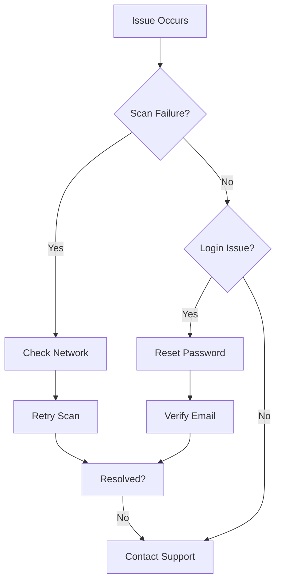

## Quick Troubleshooting Flow



Follow this flow to resolve most issues quickly.

## Handling Scan Failures

Scan failures often stem from network issues, invalid input, or rate limits.

<Callout kind="info">
  Ensure your message length is under 5000 characters and contains text content.
</Callout>

### Common Causes and Fixes

| Issue | Possible Cause | Solution |
|-------|----------------|----------|
| `ERR_NETWORK` | Poor connection | Check internet and retry |
| `RATE_LIMIT` | Too many scans | Wait 60 seconds |
| `INVALID_INPUT` | Empty or binary data | Paste plain text only |

<Steps>
  <Step title="Verify Input" icon="check">
    Confirm the text is plain and under the limit.

    ```javascript
    const text = "Suspicious message here...";
    if (text.length > 5000) {
      console.error("Text too long");
    }
    ```
  </Step>
  <Step title="Check Network" icon="wifi">
    Test your connection speed.
  </Step>
  <Step title="Retry Scan" icon="refresh-cw">
    Submit again after 30 seconds.
  </Step>
</Steps>

## Interpreting Low-Confidence Results

Low-confidence scores (under 70%) indicate potential risks but need manual review.

<Tabs>
  <Tab title="False Positive?" icon="alert-triangle">
    Review the flagged phrases against context.

    <Expandable title="Common False Triggers" default-open="true">
      Phrases like "urgent payment" in legitimate business emails.
    </Expandable>
  </Tab>
  <Tab title="Edge Cases" icon="help-circle">
    Short messages or non-English text may score lower.

    <Callout kind="tip">
      Provide more context for better accuracy.
    </Callout>
  </Tab>
</Tabs>

## Account and Login Problems

<Columns cols={2}>
  <Card title="Forgot Password" icon="key" href="#forgot-password">
    Reset via email link.
  </Card>
  <Card title="Two-Factor Issues" icon="shield" href="#2fa">
    Troubleshoot auth codes.
  </Card>
</Columns>

### Reset Password

<Steps>
  <Step title="Request Reset" icon="mail">
    Go to `https://app.scamshield.my/login` and click "Forgot Password".
  </Step>
  <Step title="Check Email" icon="inbox">
    Verify spam folder for the link.
  </Step>
  <Step title="Set New Password" icon="lock">
    Use strong password: 12+ characters, mix case and numbers.
  </Step>
</Steps>

<Expandable title="2FA Troubleshooting">
  If codes fail:
  1. Sync device time.
  2. Regenerate QR code in settings.
  3. Use backup codes.
</Expandable>

## Privacy and Data Concerns

ScamShield prioritizes your privacy with end-to-end encryption.

<Callout kind="alert">
  Scans are processed on-device where possible; server scans anonymize data.
</Callout>

### Data Handling FAQ

<ExpandableGroup>
  <Expandable title="Does ScamShield store my scans?" default-open="true">
    No, scans delete after 30 days. History is opt-in.
  </Expandable>
  <Expandable title="How to delete account data?">
    Go to Settings > Privacy > Delete All Data.
  </Expandable>
  <Expandable title="GDPR Compliance">
    EU users can request full data export via support.
  </Expandable>
</ExpandableGroup>

## API Error Handling (Developers)

For integrations, handle common errors gracefully.

<CodeGroup tabs="JavaScript,Python">
  ````javascript
  try {
    const response = await fetch('https://api.example.com/v1/scan', {
      method: 'POST',
      headers: { 'Authorization': `Bearer ${YOUR_API_KEY}` },
      body: JSON.stringify({ text: 'suspicious message' })
    });
    if (!response.ok) {
      throw new Error(`Scan failed: ${response.status}`);
    }
    const result = await response.json();
    console.log(result.confidence);
  } catch (error) {
    console.error('Handle error:', error.message);
  }
  ````
  ````python
  import requests

  headers = {'Authorization': f'Bearer {YOUR_API_KEY}'}
  data = {'text': 'suspicious message'}
  response = requests.post('https://api.example.com/v1/scan', json=data, headers=headers)

  if response.status_code != 200:
      print(f'Scan failed: {response.status_code}')
  else:
      result = response.json()
      print(result['confidence'])
  ````
</CodeGroup>

<Callout kind="success">
  Most issues resolve with these steps. Contact support@scamshield.my for persistent problems.
</Callout>